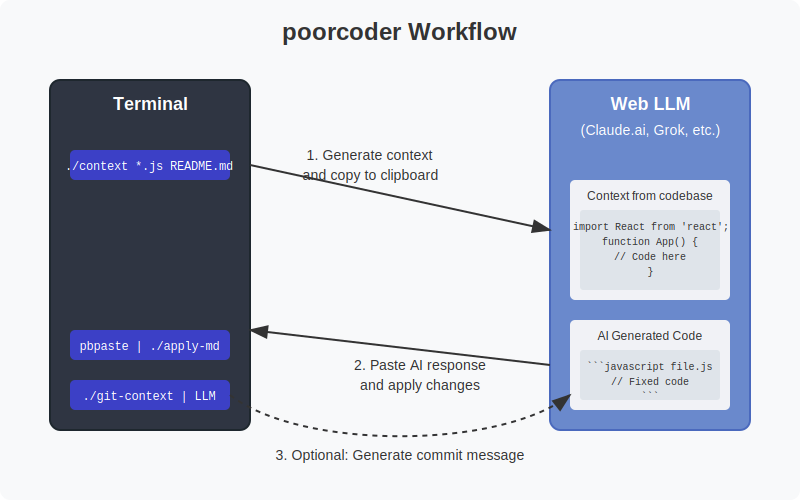
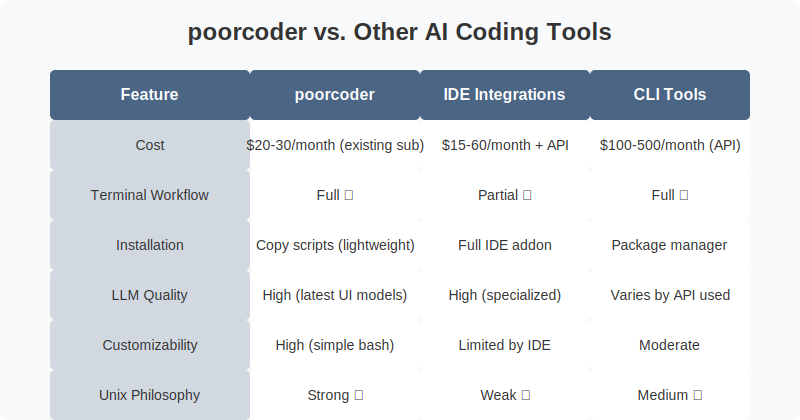
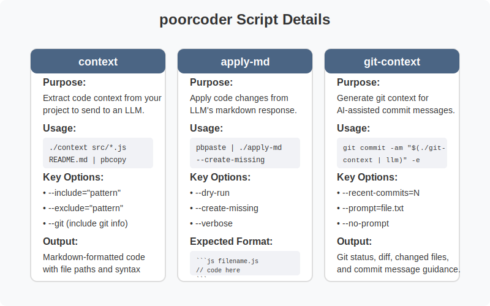
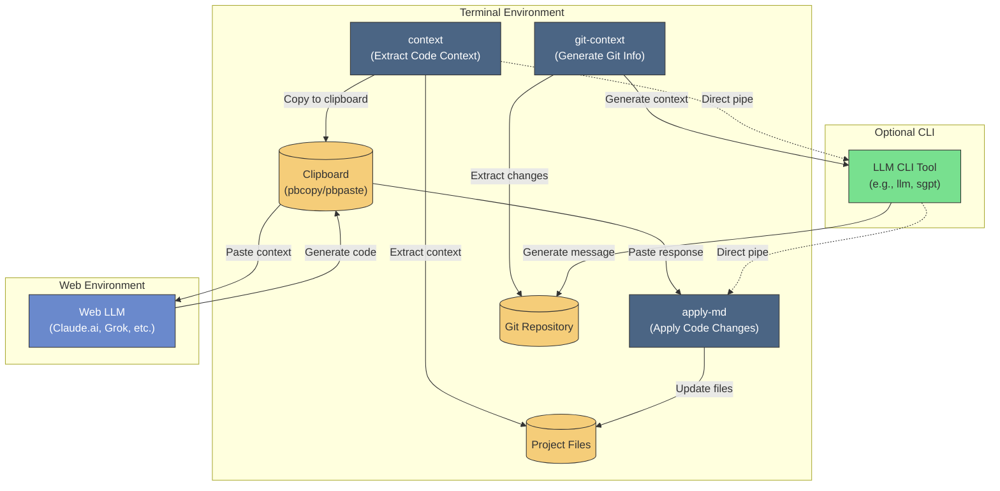

# poorcoder

A collection of lightweight Bash scripts to enhance your coding workflow with AI assistance. These tools bridge the gap between web-based AI interfaces and your terminal, allowing you to leverage subscription-based LLMs (like Claude.ai or Grok) without disrupting your development process.

## Overview

This repository contains three main tools:

1. **`context`** - Extracts code context from your project to send to an LLM
2. **`apply-md`** - Applies code changes from LLM's markdown response
3. **`git-context`** - Generates git context for AI-assisted commit messages

## Workflow

Here's how poorcoder fits into your development workflow:



## Why poorcoder?

Unlike IDE-integrated solutions (Cursor, aider, Claude Code, etc.), poorcoder is designed to work with your existing web-based LLM subscriptions (~$20-30/month) while maintaining your terminal workflow. 



Key benefits:
- Is more cost-effective than dedicated API usage (which can cost $100-500/month for heavy use)
- Leverages the polished UX of web/mobile LLM interfaces
- Preserves your terminal-based development workflow
- Follows Unix philosophy (small tools doing one thing well)

## Installation

### Standard Installation

Simply clone this repository and make the scripts executable:

```bash
git clone https://github.com/vgrichina/poorcoder.git
cd poorcoder
chmod +x context apply-md git-context
```

You can either use the scripts directly from this folder or add them to your PATH for global access.

### Project-Specific Installation (Recommended)

For heavy usage, copy the scripts and prompts directory directly into your project:

```bash
# Clone the repository
git clone https://github.com/vgrichina/poorcoder.git
# Copy essential files to your project
cp poorcoder/{context,apply-md,git-context} /path/to/your/project/
cp -r poorcoder/prompts /path/to/your/project/
# Make scripts executable
chmod +x /path/to/your/project/{context,apply-md,git-context}
```

This approach lets you customize both the scripts and prompts for your specific project workflow. You can also create custom aliases or wrapper scripts, for example:

```bash
# Create a simple autocommit script
echo '#!/bin/bash
git commit -am "$(./git-context | llm -m openrouter/anthropic/claude-3.5-haiku)" -e' > autocommit
chmod +x autocommit
```

## Scripts

Here's a detailed overview of each script in poorcoder:



### 1. `context` - Code Context Generator

Extracts relevant code context from your project to send to a web-based LLM.

```bash
# Copy context directly to clipboard (macOS)
./context --include="src/*.js" --exclude="*.test.js" | pbcopy

# Using direct patterns as arguments
./context "src/*.js" "README.md" | pbcopy

# Including git information
./context --include="src/*.js" --git | pbcopy
```

[See full documentation for context](./docs/context.md)

### 2. `apply-md` - Markdown Code Applier

Extracts code blocks from markdown (typically LLM responses) and applies changes to your filesystem.

```bash
# Paste LLM response from clipboard (macOS)
pbpaste | ./apply-md --dry-run --verbose

# Apply changes and create missing files
pbpaste | ./apply-md --create-missing
```

[See full documentation for apply-md](./docs/apply-md.md)

### 3. `git-context` - Git Context Generator

Generates git-related context to help LLMs create meaningful commit messages.

```bash
# Generate context, then use with API-based LLM via CLI tool
git commit -am "$(./git-context | llm -m openrouter/anthropic/claude-3.5-haiku)" -e
```

[See full documentation for git-context](./docs/git-context.md)

## Component Interaction

The following diagram shows how the different components of poorcoder interact with each other and with external systems:



## Usage Workflows

### Dual Modality Approach

poorcoder supports two primary workflows:

#### 1. Web UI LLM + Terminal

Ideal for complex interactions and leveraging your LLM subscription:

```bash
# 1. Generate context and copy to clipboard
./context --include="src/components/*.js" | pbcopy

# 2. Paste into web UI (Claude.ai, Grok, etc.), ask for changes

# 3. Copy response and apply changes
pbpaste | ./apply-md --create-missing
```

#### 2. All-Terminal with CLI LLM

For quick operations or automation using LLM CLI tools:

```bash
# Generate commit message using LLM CLI
git commit -am "$(./git-context | llm -m openrouter/anthropic/claude-3.5-haiku)" -e

# Fix a small issue directly in terminal
./context --include="src/buggy-file.js" | llm "Fix the null reference bug" | ./apply-md
```

### Scenario: Bug Fix in a Complex Project

1. Gather relevant context:
   ```bash
   ./context --include="src/utils/validation.js" --include="src/components/Form.js" | pbcopy
   ```

2. Paste into Claude.ai or Grok with your request:
   "There's a bug where form validation fails when empty strings are submitted. Fix it while maintaining our validation approach."

3. Copy the AI's response and apply changes:
   ```bash
   pbpaste | ./apply-md --dry-run  # Preview changes
   pbpaste | ./apply-md            # Apply changes
   ```

4. Generate a commit message:
   ```bash
   git commit -am "$(./git-context | llm -m openrouter/anthropic/claude-3.5-haiku)" -e
   ```

## Integration with Other Tools

poorcoder works with various tools to create a seamless workflow:

- **Web LLMs**: Claude.ai, ChatGPT, Grok, etc.
- **LLM CLI tools**: `llm`, `sgpt`, `chatgpt-cli`, etc.
- **Clipboard utilities**: `pbcopy`/`pbpaste` (macOS), `xclip` (Linux)
- **Version control**: `git`

## Contributing

Contributions are welcome! Feel free to submit a pull request or open an issue to suggest improvements.

## License

The Unlicense (public domain)
